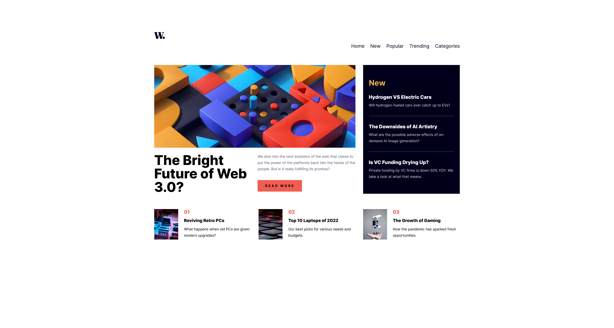

# Frontend Mentor – News homepage solution

This is my solution to the [News homepage challenge on Frontend Mentor](https://www.frontendmentor.io/challenges/news-homepage-H6SWTa1MFl).

This challenge was especially fun because it repeated a lot of core layout concepts while putting a stronger focus on accessibility. The mobile navigation was new for me, but also one of the most enjoyable parts to implement.

## Overview

### The challenge

Users should be able to:

- View an optimal layout depending on their device's screen size
- Use a fully accessible navigation menu
- Navigate the page using keyboard controls
- See clear hover and focus states for all interactive elements

### Screenshot

### Links

- Solution URL: <!-- Frontend Mentor solution link -->
- Live Site URL: [<!-- Live demo link -->](https://d0bbysocks.github.io/newsHomepage/)

## My process

### Built with

- Semantic HTML5
- Mobile-first CSS
- CSS custom properties (design tokens)
- CSS Grid & Flexbox
- Vanilla JavaScript
- Accessibility-focused patterns (ARIA, focus management, `hidden`)

### What I learned

This challenge was a great refresher for layout fundamentals and accessibility best practices.

Key takeaways:

- Mobile-first layouts are much easier to reason about when desktop changes are grouped in a single media query
- Using the `hidden` attribute is a clean and accessible way to control visibility
- A single navigation with two visual representations (mobile overlay vs. desktop inline) avoids duplicated markup
- Separating responsibilities clearly:
  - CSS handles layout and visuals
  - JavaScript only manages state
- Implementing an accessible mobile menu (ARIA attributes, Escape handling, focus return) without overengineering

The mobile navigation was new for me, but turned out to be a really fun problem to solve.

### Continued development

In future projects, I want to continue improving:

- Accessible navigation patterns
- Focus management without unnecessary complexity
- Clean CSS architecture for responsive layouts
- Writing JavaScript that stays purely state-driven

### Useful resources

- MDN Web Docs – Accessibility & ARIA
- Frontend Mentor community solutions for comparison and inspiration

## Author

- Frontend Mentor – [@D0bbysocks](https://www.frontendmentor.io/profile/D0bbysocks)

## Acknowledgments

Thanks to the Frontend Mentor community for great feedback and inspiration.
